# Git and GitHub tutorial
Git and GitHub tutorial for Primers for Predocs 2023.


## Contents
* [Prerequisites](#prerequisites)
* [Configuration](#configuration)
* [Events](#events)
	* [Create a Branch](#create-a-branch)
	* [Open a Pull Request](#open-a-pull-request)
* [Actions](#actions)
* [Additional Resources](#additional-resources)
* [Acknowledgements](#acknowledgements)

## Prerequisites
* **GitHub account**. Please verify you can log in without problem. If you don't have a GitHub account you can sign up [here](www.github.com).
* **Record of a registered primary email**. In your GitHub account [settings](https://github.com/settings/emails), a primary email address record should be displayed as shown below and you need to be able to access this email account. You can also
add your institutional mail address.
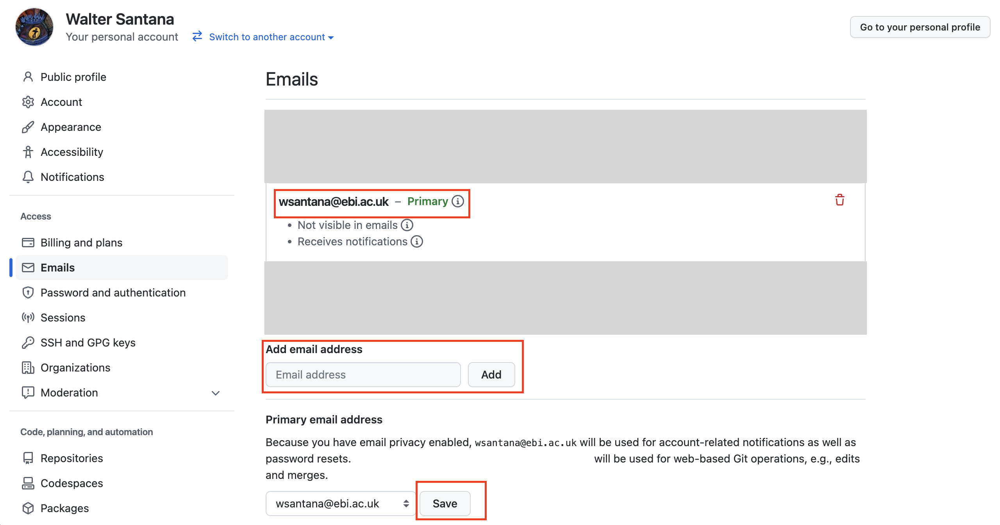  

## Configuration

**Background**: To push code from your working station (cluster, laptop, Virtual Machine, etc.), GitHub requires the use of a Personal Access Token (PAT) or an SSH Authentication.

**Aim**: We will set up the SSH Authentication to push code to our GitHub account. In particular, we will generate a SSH-key in our machine and then add it to our GitHub account. Finally, we will clone this repository using the repository's SSH link.

1. Log into the Virtual Machine (VM) following the [course instructions](https://docs.google.com/presentation/d/1btz9MYEP0_7ruux-7InnwFQnVwxLzIKY/edit#slide=id.p1).
2. Open the terminal and run:
    ```bash
    mkdir -p ~/.ssh
    cd ~/.ssh
    ssh-keygen -t ed25519 -f github_key -C "your_github_email@example.com" -N ''
    cat ~/.ssh/github_key.pub
    ```
    Please note that you need to generate a key in each working machine that will be used for pushing code to GitHub.

3. Select and copy the last command's output (i.e. SSH key)
4. Open a browser and then go to [GitHub SSH keys](https://github.com/settings/keys). Click 'New SSH key'
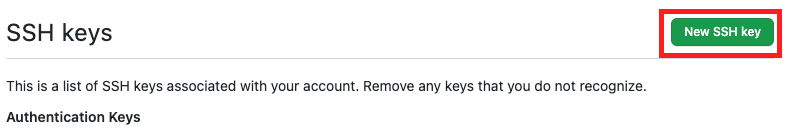

5. Enter a name for the new SSH key that will be added and select "Authentication Key" from the dropdown menu.
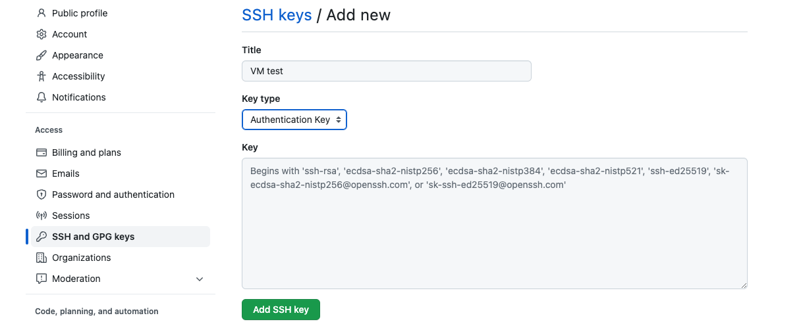   

6. Paste the SSH key from *step 3* in the "Key" field
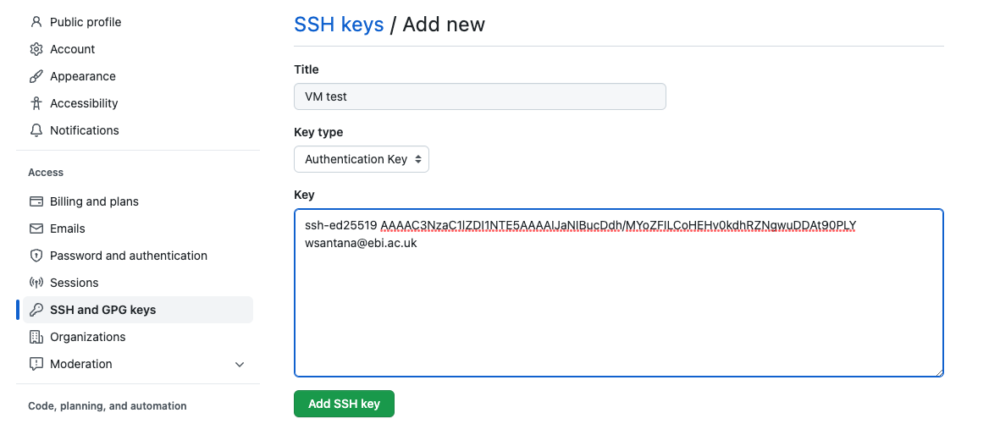
7. Return to the VM's Terminal and create a `config` file in the `~/.ssh/` directory.
   ```bash
   touch ~/.ssh/config
   ```
8. Open the `config` file using a text editor (e.g. emacs,nano or vim) and paste in the following content:
   ```bash
   Host github.com
   	HostName github.com
   	IdentityFile ~/.ssh/github_key
   ```
   The `config` file allows you to specify which SSH key to use for each machine/application connection. It becomes even more useful when multiple SSH keys are stored in the `~/.ssh/` directory to interact with different machines.

9. Set local user information (username and email) for Git in your VM.
   Every commit in Git will use this information.
   ```bash
   git config --global user.email "your_github_email@example.com"
   git config --global user.name "your_github_username"
   ```
   Please note that the `user.email` should be associated to your GitHub account.

10. Copy the repository's URL `git@github.com:santanaw/primers4predoc-git.git`. Alternatively you can copy it from the *Code* button in the main [repository's main page](https://github.com/santanaw/primers4predoc-git)
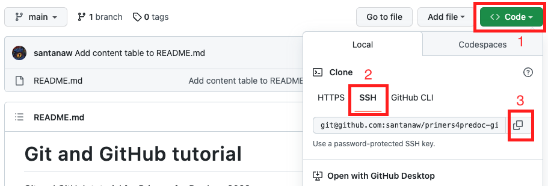
The SSH link is neaded instead of the HTTPS when using the SSH Authentication method.

11. Clone the repository in your `~/Documents` directory.
    ```bash
    cd ~/Documents
    git clone git@github.com:santanaw/primers4predoc-git.git
    ```


## Events


### Create a Branch
**Background**: Branches are important features of the Git environment. They allow to develop pieces of code safely in a contained area of the repository without affecting the "main" code -which is considered the *default* branch. Working on a branch is always a good practice when developing features or just experimenting with some ideas! More information [here](https://docs.github.com/en/pull-requests/collaborating-with-pull-requests/proposing-changes-to-your-work-with-pull-requests/about-branches).

**Aim**: Create a branch and fix the bug in your assigned script.

1. Click on the [Issues](https://github.com/santanaw/primers4predoc-git/issues) tab of this repository and find your assigned bug issue (search for your GitHub username on the issue title). Click on it.
2. Write down your **assigned issue number** (preceded by a hashtag after your username), and identify in the first comment the **name of the script file** you will fix.
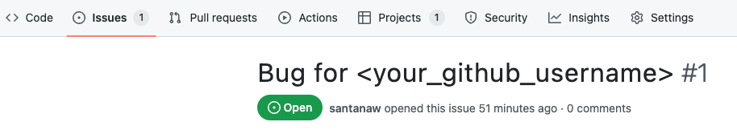
3. Open your VM's Terminal and go to the `primers4predoc-git` directory. Then, identify the branch you are standing on.
   ```bash
   cd ~/Documents/primers4predoc-git
   git status
   ```
   **Question**: *What's the name of the branch we are standing on?*

4. Create a branch. Name it with your issue number (identified on *step 2*), as in `issue<your_issue_number>-bugfix` (e.g. issue1-bugfix). Please make sure the branch is named following this convention.
   ```bash
   git checkout -b issue<your_issue_number>-bugfix
   ```
5. Identify the branch you are standing on. The branch should have changed.
   ```bash
   git status
   ```
6. Open your assigned script file (identified on *step 2*) using a text editor and fix it!
7. Add your changes to staging area when you are happy with the bug fix.
   ```bash
   git add src/<assigned-script>
   ```
8. Commit your changes. Please include in your commit message a hashtag followed by your **assigned issue number** from *step 2* (e.g. #1).
   ```bash
   git commit -m "your commit message #<issue-number>"
   ```
9. Push your changes to the GitHub repository. When pushing to a new branch for the first time, you should include `--set-upstream origin <branch-name>` in your command.
   ```bash
   git push --set-upstream origin <branch-name>
   ```
   After this first push to the branch only run `git push`.

10. Go to the top of this tutorial and click on the dropdown menu "main", you sould be able to see the branch you created.
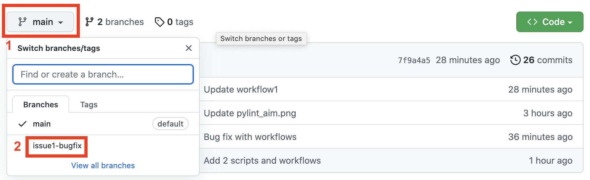
11. Go to the [Issues](https://github.com/santanaw/primers4predoc-git/issues) tab again and then to your assigned bug issue. You should see your commit. This was automatically linked when the issue number was used in your commit message.

### Open a Pull Request

**Background**: Pull requests allow to notify others of the recently commited changes to the repository, so they can review and test your code before incorporating (*pulling*) them to the "main" branch. More information [here](https://docs.github.com/en/pull-requests/collaborating-with-pull-requests/proposing-changes-to-your-work-with-pull-requests/about-pull-requests).

**Aim**: Open a pull request for the branch you created and pushed.

1. Identify the yellow banner at the top of this repository and click on "Compare & pull request".
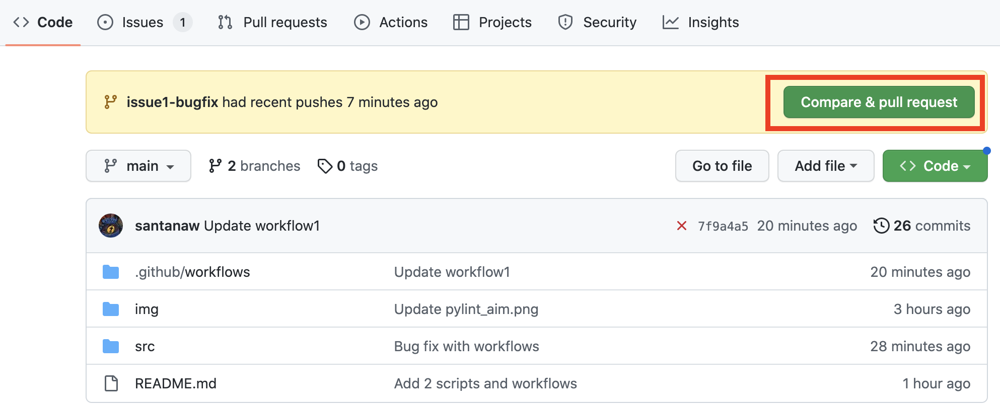

2. You wil be redirected to a new page where you will need to confirm the pull request after reviewing the changes between the two branches. Click on "Create pull request".
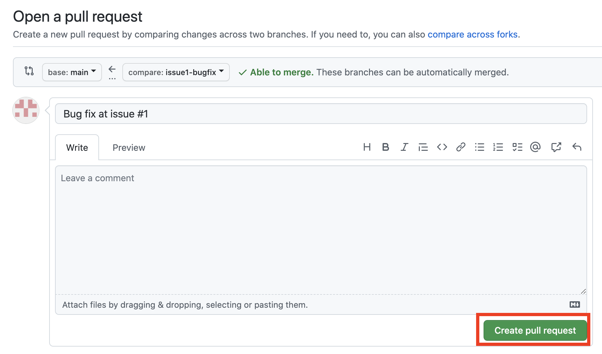

   After pull requests are created, people review the changes. They can reject the pull request or accept and incorporate (merge) the commits on *your branch* to the *main branch*.

## Actions

**Background**: GitHub Actions is a platform for Continuous Integration and Continuous Delivery (CI/CD). It allows you to build,test and deploy pipelines automaticaly. For instance, you can create workflows that allow you to test code after every "push" action, and thus catch errors. More information [here](https://docs.github.com/en/actions/learn-github-actions/understanding-github-actions).

**Aim**: Fix the errors reported by the Pylint workflow so the Pylint status shield (top of this page) can change from "*failing*" to "*passing*".


1. Click on the branch you created in this repository. Please see *step 10* of the **Create a Branch** section.

2. Click on the 'X' that precedes the commit hash number (marked by 1 in figure below). A list of the executed GitHub workflows will be displayed showing a "failing" or "passing" status. Identify the workflow with your assigned issue number (see *step 2* of the **Create a Branch** section) and then click on the "Details" link (marked by 2 in figure below).
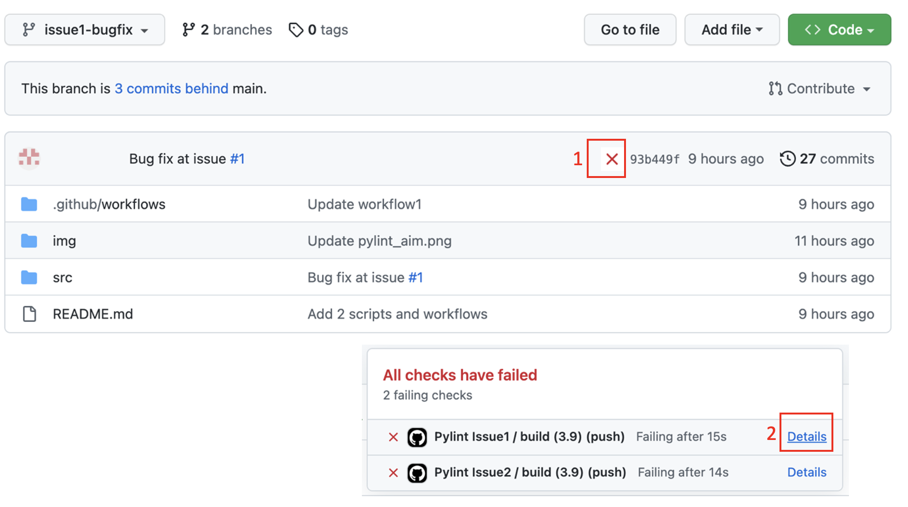

3. Click on the "Analysing the code with pylint" secction and read the output message of the Pylint tool.
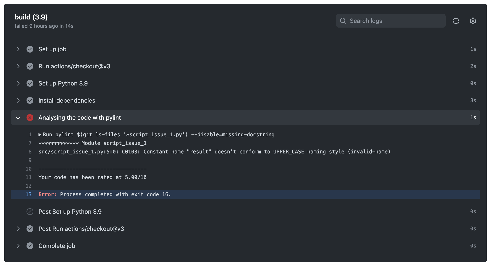

4. In your VM open your assigned script file (identified on *step 2* of the **Create a Branch** section) using a text editor and make the relevant changes to comply with the expected coding standards for Pylint.

5. Commit and push your changes after editing your script. Follow the steps from *step 7* onwards of the **Create a Branch** section. After the push you should be able to see a "passing" status from the output of your GitHub workflow.

   I will merge all your branches and then Pylint shields should start changing their status from "failing" to "passing". Please note that this status change is not immediate and may take several minutes.


## Additional Resources

* Create your shields with shields IO. [GitHub](https://github.com/badges/shields) [Webpage](https://shields.io/)
* [Pylint tutorial](https://pylint.pycqa.org/en/latest/)
* [Learn about Git Hooks!](https://githooks.com/)
* [More fun with gitmojis for your commit messages](https://gitmoji.dev/)

## Acknowledgements

Parts of this tutorial were taken or adapted from the[ Git tutorial of Primers for Predocs 2022](https://github.com/helrick/git-tutorial). Thank you Hilary!

